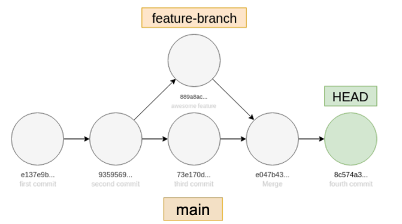

# Support Engineer Take-home Assessment

## Question 1

Write a Ruby or Bash script that will print usernames of all users on a Linux system together with
their home directories. Here's some example output:

- gitlab:/home/gitlab
- nobody:/nonexistent

Each line is a concatenation of a username, the colon character (:), and the home directory path
for that username. Your script should output such a line for each user on the system.

Next, write a second script that:
- Takes the full output of your first script and converts it to an MD5 hash.
- On its first run stores the MD5 checksum into the /var/log/current_users file.
- On subsequent runs, if the MD5 checksum changes, the script should add a line in the /var/
log/user_changes file with the message, DATE TIME changes occurred, replacing DATE
and TIME with appropriate values, and replaces the old MD5 checksum in /var/log/
current_users file with the new MD5 checksum.

Finally, write a crontab entry that runs these scripts hourly.
Provide both scripts and the crontab entry for the answer to be complete.

### Answer

#### Part 1
A Bash Script that print usernames of all users on a linux system together with their home directories.

```
#!/bin/bash

# Author: Amos 
# Date Created: 19/08/2023
# Last Date Modified: 19/08/2023

# Description
# Print usernames of all users on a linux system together with their home directories.

# Usage
# user_home_dirs.sh


while IFS=':' read -r username _ _ _ _ home_directory _; do
    echo "$username:$home_directory"
done < /etc/passwd
```

Save this script to a file, for example, *user_home_dirs.sh*, and make it executable with the following command:

```
chmod +x user_home_dirs.sh
```
You can run the script as below
```
./user_home_dirs.sh
```

#### Part 2
A Bash script that takes the list of a all usernames in a Linux system including their home directories
, converts it into an MD5 hash, stores it in /var/log/current_users if no changes. Otherwise, if there
are changes to the file, logs the changes together with the date the changes occurred and stores
the new file in /var/log/user_changes.
```
#!/bin/bash

# Author: Amos 
# Date Created: 19/08/2023
# Last Date Modified: 19/08/2023

# Description
# Print usernames of all users on a linux system together with their home directories.

# Usage
# md5_and_log_change.sh

# Paths to log files
current_users_log="/var/log/current_users"
user_changes_log="/var/log/user_changes"

# Calculate MD5 checksum of user data and store it
md5_checksum=$(./user_home_dirs.sh | md5sum | awk '{print $1}')

# If the current MD5 checksum is not stored, store it and exit
if [[ ! -f "$current_users_log" ]]; then
    echo "$md5_checksum" > "$current_users_log"
    exit 0
fi

# Read stored MD5 checksum
stored_md5_checksum=$(cat "$current_users_log")

# Compare current and stored checksums
if [[ "$md5_checksum" != "$stored_md5_checksum" ]]; then
    # Log the changes with date and time
    changes_message="$(date +'%Y-%m-%d %H:%M:%S') changes occurred"
    echo "$changes_message" >> "$user_changes_log"

    # Update stored MD5 checksum
    echo "$md5_checksum" > "$current_users_log"
fi
```
Save this script to a file, for example, *md5_and_log_changes.sh*, and make it executable with the following command:

```
chmod +x md5_and_log_changes.sh
```
#### Crontab entry
To run the scripts hourly, run *crontab -e* on your terminal, which will open the crontab editor and add the below line to your crontab entries. Remember to replace */path/to/* with the actual path to where you saved your *md5_and_log_changes.sh* script.
```
0 * * * * /path/to/md5_and_log_changes.sh
```

## Question 2
A user is complaining that it's taking a long time to load a page on our web application. In your own words, write down and discuss the possible cause(s) of the slowness. Also, describe how you would begin to troubleshoot this issue. Keep the following information about the environment in mind:

- The web application is written in a modern MVC web framework.
- Application data is stored in a relational database.
- All components (web application, web server, database) are running on a single Linux box with
8GB RAM, 2 CPU cores, and SSD storage with ample free space.
- You have root access to this Linux box.

### Answer

Slowness in a web application can be caused by a variety of factors, and troubleshooting it requires a systematic approach. Here are some possible causes of the slowness and troubleshooting steps you might consider:

#### Possible Causes of Slowness:

- Resource Constraints: The server's hardware specifications seem reasonable for a basic setup, but it's important to ensure that CPU, memory, and disk usage are not consistently maxed out, causing delays in processing requests.

- Database Queries: Complex or inefficient database queries can lead to slow page loading times. This could result from missing indexes, poorly optimized queries, or an increased load on the database.

- Network Latency: If there are network issues between components, it can lead to delays in data retrieval and communication, impacting the overall application speed.

- Code Inefficiencies: Poorly written code, such as using nested loops or excessive database queries, can lead to slowness. This could be in the application code, the web server configuration, or other parts of the stack.

- Caching: Ineffective or missing caching mechanisms can lead to repeated processing of the same data, slowing down page loads.

- External Services: If the application relies on external services (e.g APIs), delays or downtime in those services can affect the overall application performance.

#### Steps to Troubleshoot:

- Monitoring and Benchmarking: Start by monitoring system resource usage (CPU, memory, disk, network) using tools like top, htop, and iotop. Benchmark the application's response time using tools like ab (Apache Bench) to identify baseline performance.

- Database Optimization: Analyze slow database queries using tools like EXPLAIN in SQL to identify missing indexes or poorly performing queries. Optimize the database schema and queries accordingly.

- Code Profiling: Use debugging and profiling tools specific to the MVC framework to identify bottlenecks in the code. Look for areas with high execution time or excessive database calls.

- Caching Strategies: Implement effective caching mechanisms for frequently accessed data. Utilize techniques like page caching, object caching, and query caching to reduce the load on the database.

- Network Analysis: Check for network latency or connectivity issues using tools like ping and traceroute. Ensure that the web server and database can communicate without delays.

- Server Configuration: Review the web server configuration for performance optimizations. Adjust settings like worker processes, request timeout, and keep-alive to match the application's needs.

- Logging and Monitoring: Enable detailed application and server logs to track requests, errors, and slow queries. Use monitoring tools like Prometheus to gain insights into application performance over time.

- External Services: Check the status and response times of any external services the application depends on. Consider implementing timeouts and graceful handling of service failures.

- Load Testing: Simulate higher-than-normal loads using tools like Apache Bench or JMeter to observe how the application performs under stress. This can help uncover bottlenecks that might not be visible during regular usage.

- Profiling Tools: Use profiling tools like strace or dtrace to analyze system calls, CPU usage, and other low-level metrics to identify potential performance issues.

- Scaling: If all else fails, consider scaling out the application by separating components onto different servers. This could involve setting up a separate database server, caching server, or load balancer.

Remember that troubleshooting can be complex issue, and it might involve a combination of factors. It's important to approach the issue methodically, gather data, and make incremental changes while monitoring the impact of each change.

## Question 3
Study the Git commit graph shown below. What sequence of Git commands could have resulted in
this commit graph?


### Answer
The below steps shows the possible sequence of steps that could have resulted in th git commit graph above.

Disclaimer! The below steps assumes there are no merge conflicts. If you get into merge conflicts, you have to resolve them manually.
```
# Step 1: Start with the main branch if already not
git checkout main
# Step 2: Do some work, example on a file, then stage
git add .
# Step 3: Commit the changes
git commit -m "main branch first commit"
# Step 4: Do some work, make the second commit
git commit -m "main branch second commit"
# Step 5: While on the main branch, create a new branch named "Feature-branch and switch to it"
git checkout -b feature-branch
# Step 6: Do some work on the feature-branch, then stage
git add .
# Step 7: Commit the changes
git commit -m "feature-branch first commit"
# Step 8: Switch to main branch
git checkout main
# Step 9: Do some work on the main branch, then stage
git add .
# Step 10: Commit the changes
git commit -m "main branch third commit"
# Step 11: Now, while still on main branch, merge the feature-branch to main branch
git merge feature-branch
```

## Question 4

GitLab has hired you to write a Git tutorial for beginners on: Using Git to implement a new
feature/change without affecting the main branch. In your own words, write a tutorial/blog explaining things in a beginner-friendly way. Make sure to address both the "why" and "how" for each Git command you use. Assume the audience are readers of a well-known blog.

### Answer

# Git Tutorial for Beginners
                            
## Introduction
Welcome to this beginner-friendly Git tutorial! If you're new to version control and want to learn how to use Git to implement new features or changes without affecting the main branch, you're in 
the right place. Git provides a powerful way to work collaboratively on projects while
maintaining a clean and organized codebase. In this tutorial, we'll guide you through 
the process step by step.

## What you need
- [Install Git on your local machine](https://docs.gitlab.com/ee/tutorials/make_first_git_commit/index.html)
- Ensure you can sign in to an instance of GitLab. If do not have a GitLab account already, create an account on GitLab.com.
- [Create SSH keys and add them to GitLab](https://docs.gitlab.com/ee/user/ssh.html) - SSH keys are how you securely communicate between your computer and GitLab.


## Git Repository

What is a repository in Git? You store files, like code or documents, in a Git repository. When you want to edit the files, you clone the repository to your computer, make the changes, and push your changes back to the repository. In GitLab, a Git repository is located in a project. The .git/ folder inside a project. This repository tracks all changes made to files in your project, building a history over time. Meaning, if you delete the .git/ folder, then you delete your project’s history.

## Steps
### 1. Create a Git repo for your project
To create a repo for your project in GitLab. Log in into your GitLab account
- On the left sidebar, at the top, select Create new () and New project/repository.
- For Project name, enter Gitlab_assessment. The project url is generated for you which you can use to access the project after it’s created.
- Ensure Initialize repository with a README is selected.  You can leave the other options in their default.
- Select Create project.

### Step 2: Clone the Repository
The next step is to clone your just created project/repo to your local machine. Cloning creates a copy of the repository on your local machine. On your GitLab accout project page, select Clone. Copy the URL for Clone with SSH. Then, from your local machine terminal. Create a folder where you what to build your project. Navigate to the folder and then run the following command:

```
git clone <repository-url>
```
Replace <repository-url> with the URL of the repository. This is the URL you copied from your GitLab project page.

By default, you’ve cloned the default branch for the repository. Usually this branch is main. To check which branch you are currently on, run the below command.
```
git branch
```
The branch you’re on is marked with an asterisk. 

### Step 3: Create a New Feature Branch

Before making changes, it's a good practice to create a feature branch. A branch is like a separate workspace where you can work on your changes without affecting the main branch. From your local machine terminal and inside your project folder. Run the following command:

```
git checkout -b feature-branch
```
The above command creates a new branch named "feature-branch" and switches to it.

### Step 4: Make and Commit Changes

Now it's time to make your changes. Open your favorite code editor, make the necessary modifications to your code or document, and save the files. End back to your terminal and run the below commands in their order.

Note: 
The, <git status> command checks which files have been modified and need to be staged.
The, <git add .> command stages the changes or rather prepares the changes ready to be committed.
The, <git commit> command saves the changes.

```
# Check the status of your changes
git status
```
You should see something similar to this;
```
On branch main
Changes not staged for commit:
  (use "git add <file>..." to update what will be committed)
  (use "git restore <file>..." to discard changes in working directory)
	modified:   README.MD

no changes added to commit (use "git add" and/or "git commit -a")

```
Add the modified files to the staging area
```
# Add the modified files to the staging area
git add .
```
Commit the changes
```

# Commit the changes with a descriptive message
git commit -m "Add new feature: description of changes"
```
To verify that your staged files have successifuly been committed. Run the git status command again.
```
git status
```
You should see something similar to this;
```
On branch main
nothing to commit, working tree clean

```
### Step 4: Push Changes to Remote
Once you've committed your changes locally, it's time to push them to the remote repository - the GitLab repo
```
git push origin feature-branch
```
Your branch is now available on GitLab and visible to other users in your project.

### Step 5: Review and Merge
Your team will now review your changes. You can discuss, make improvements, and iterate on your code based on feedback.
Once your changes are approved, they can be merged into the main branch.
To merge your changes. Run the below commands.
```
# Switch to the main branch
git checkout main

# Merge your feature-branch to the main branch
git merge feature-branch

# Push the changes to your GitLab repo
git push origin main
```
You can view your changes on your GitLab account project page.

### Step 6: (Optional) Delete branch
After your changes are merged, you can delete your feature-branch if it's no longer needed.
Run the below command to delete
```
# Delete the local feature branch
git branch -d feature-branch
```
## Conclusion
Congratulations! You've successfully learned how to use Git to implement a new feature or change without affecting the main branch.

## Question 5


### Answer
I recently read a blog post on [Proper HTTP Shutdown in Go](https://dev.to/mokiat/proper-http-shutdown-in-go-3fji).  Here's a summary of what I liked and what I didn't like about it.
#### What I Liked:

- Clear Explanation: The blog post effectively explains the importance of graceful HTTP shutdown, especially in the context of horizontally scaled microservices and rolling updates. It establishes why this process is crucial for avoiding downtime or failed requests during updates.

- Real-world Scenarios: The author provides practical scenarios and examples, making it easier for readers to relate to and understand the concepts being discussed.

- Code Illustrations: The blog post uses code examples at different stages to show the progression of implementations. This helps readers visualize the changes and understand the issues being addressed.

- Problem Identification: The author does a great job of identifying problematic implementations and their shortcomings. By pointing out common mistakes, readers can learn from these pitfalls and avoid them in their own projects.

- Detailed Solutions: The blog post provides multiple iterations of solutions to the problem, gradually improving the code to achieve a proper graceful shutdown. This iterative approach is insightful for learning the thought process behind each step.

- Signal Handling: The post introduces the concept of signal handling and explains its role in achieving graceful shutdown. It also addresses the common mistake of using Shutdown inside a goroutine, highlighting the importance of proper placement.

#### What I didn't like:
Overall, the blog post effectively addresses the topic of proper HTTP shutdown in Go, offering clear explanations, real-world scenarios, and detailed solutions. By highlighting common mistakes and presenting improved implementations, the author provides valuable insights for developers like me striving to implement graceful shutdown in their applications. 
Therefore, honestly speaking, I did not find anything that I didn't like. Kudos to the author for creating a top-notch tutorial that not only educates but also engages readers from start to finish.

## Reference
- <https://docs.gitlab.com/ee/tutorials/make_first_git_commit/index.html>
- <https://www.gnu.org/software/bash/manual/bash.html>
- <https://stackify.com/web-application-problems/>
- <https://stackify.com/how-to-diagnose-application-slowness/>


